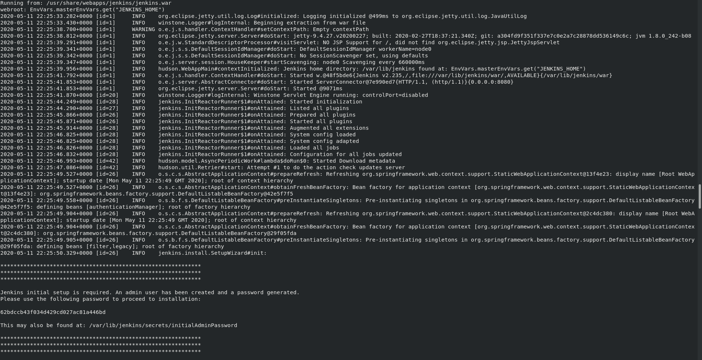
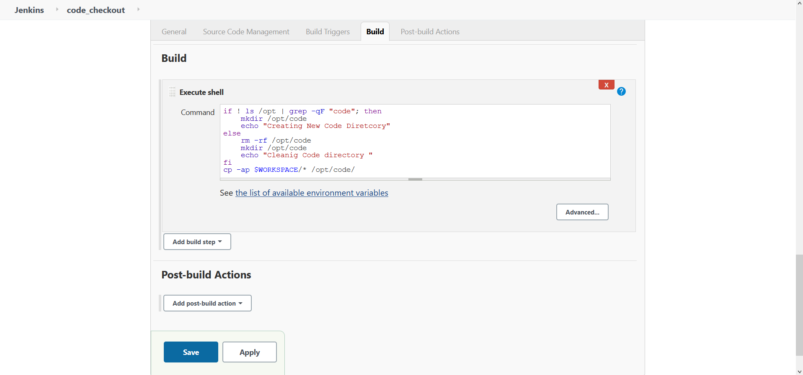

# Automated Deployment and Testing


### Tasks

#### Jenkins Image using Dockerfile

The Dockerfile is created from the `alpine:latest` linux image minimising the storage required to run the jenkins container. The image contains the docker cli to launch the docker containers in the following tasks. 

The dockerfile extract is as follows :

```
FROM alpine:latest

RUN apk --update add jenkins docker git openrc -X http://dl-cdn.alpinelinux.org/alpine/edge/community

RUN rc-update add docker boot

ARG http_port=8080

ARG HOME=/var/lib/jenkins

ENV JENKINS_HOME ${HOME}

ENV USER jenkins

EXPOSE ${http_port}

CMD ["java","-jar","/usr/share/webapps/jenkins/jenkins.war"]

```

The dockerfile should always start with `FROM` instruction. The FROM instruction specifies the Parent Image from which we are building. The `RUN` instruction is used to execute the shell commands during the build creation. The `ENV` instruction is used to set environment variables for the image. The `EXPOSE` instruction is used to perform Port Address Translation in the container i.e; exposing a service to the outside world. The `CMD` instructions are executed at the run time i.e during the container creation. 


The image can be easily created using  dockerfile using `docker build` command. 

```
mkdir /opt/jenkins
cd /opt/jenkins

# Create file name Dockerfile with the earlier mentioned steps

docker build -t jenkins:v1 /opt/jenkins/ --network=host
```

*-t* parameter denotes the tag for the image

*/opt/jenkins* represents the directory that consists Dockerfile.


Initialising jenkins container using image

```
 docker run -dit -v jenkins_data:/var/lib/jenkins -v /var/run/docker.sock:/var/run/docker.sock \
         --name jenkins -p 8080:8080 riteshsoni296/jenkins:latest
```

The jenkins container data directory `/var/lib/jenkins` is mounted on docker volume for data persistency during unavoidable circumstances.
The docker dameon socket is mounted to enable docker cli from inside the jenkins container.

During the initialisation of jenkins server for the first time, the Jenkins server proides `secret key` in the console logs for the first time login.

<p align="center">
  
  <br>
  <em>Fig 1.: Jeknins Server Startup  </em>
</p>


#### Trigger Deployment when changes are pushed to SCM

##### Job1 : Trigger Job due to SCM Changes

Steps to create the `code_checkout` job are as follows:

1. Create a *New Item* at the left column in Jenkins Welcome page

2. Configure *Job Name*

<p align="center">
  
  <br>
  <em>Fig 2.: Job Name Configuration  </em>
</p>

3. Configure *GitHub Project URL*

<p align="center">
  
  <br>
  <em>Fig 3.: GitHub Project URL </em>
</p>

4. Configure *Source Code Management*

  We are only tracking the master branch, since the code is pushed finally in master branch.

<p align="center">
  
  <br>
  <em>Fig 4.: Source Code Management Configuration  </em>
</p>

5. Steps to perform at *build Stage*

  The source code is copied into the project deployment directory i.e */opt/code*. The script is present in directory scripts in the repository named 'code_checkout_build_stage.sh'. The contents of script needs to be copied in the build stage of the job.
 
 <p align="center">
  
  <br>
  <em>Fig 5.: Code Checkout Build Stage  </em>
</p>

6. Click on Apply and Save


##### Job2 : Check the language of code and deploy the code

Steps to create the `code_deployment` job are as follows:

1. Create a *New Item* at the left column in Jenkins Welcome page

2. Configure *Job Name*

3. Configure *Build Triggers*
   The build trigger is configured to trigger the job when the upstream job `code_checkout` is stable i.e successful.
   
<p align="center">
  
  <br>
  <em>Fig 6.: Deployment Job Build Triggers Configuration  </em>
</p>

4. Operations to perform at *build stage*

   In the build stage, the project deployment directory is scanned for HTML and PHP pages with extension .html and .php respectively. If the project directory contains both HTML annd PHP language code, then customised image i.e; `riteshsoni296/apache-php7:latest` will be used to launch the container otherwise the apache web server image will be used to launch the apache web server container for HTML ccode deployment.
   
   The customised php along with apache server contains only selected packages i.e;php7, php7-fpm, php7-opcache, php7-gd, php7-mysqli, php7-zlib, php7-curl. The image can be extended as per requirements using Dockerfile. The `Dockerfile` for riteshsoni296/apache-php7:latest image is stored in the repository for reference.
   
  The shell script that is to copied in the Build Stage is present in the respository at location `scripts/code_deployment_build_stage.sh`
   
<p align="center">
  
  <br>
  <em>Fig 7.: Deployment Job Build Stage Configuration  </em>
</p>

5. Apply and Save 


##### Job3 and Job4 : Test the code and Send alerts to developer

Steps to create the `code_test` job are as follows:

1. Create a *New Item* at the left column in Jenkins Welcome page

2. Configure *Job Name*

3. Configure *Build Triggers*
   The build trigger is configured to trigger the job when the upstream job `code_deployment` is stable i.e successful.

<p align="center">
  
  <br>
  <em>Fig 8.: Test Job Build Triggers Configuration  </em>
</p>
   
4.  Operations to perform at *build stage*

    In case of Web container is running, then the private IP of container is fetched and the code reachability is verified using curl command. If the curl command output gives numeric value other than 200, the job is considered as failed by passing exit status 1.
    
    ```
    curl -s -w "%{http_code}" -o /dev/null http://10.10.15.12
    ```
    
    In the above command, 
    *-s,* is used to execute command in silent mode
    *-w,* used to write output of the curl command
    *http_code,* parameter prints out the return HTTP status code
    *-o /dev/null,* used to dump the output of the curl command.
    *10.10.15.12,* IP Address of web container
    
    The script is present for reference in repository at location `scripts/code_test_build_stage.sh`.
    
<p align="center">
  
  <br>
  <em>Fig 9.: Test Job Build Stage Configuration  </em>
</p>
    
    

